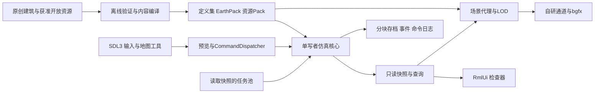

# 初步工程总纲

本轮把设计 v0.6 与用户追加要求变成可启动的工程基线。自研意味着我们掌握仿真、事务、场景、渲染通道、内容编译、交互工具及存档的边界；不要求重新编写窗口系统、GPU驱动、字体光栅化或骨骼插值。

## 1. 必须先攻克的问题

|突破点|为什么目录拆分不能解决|本框架的具体推进|
|同一份事实跨领域守恒|教会、企业、Army都可能使用同一人、同一钱和同一货；各自库存会重复制造财富|身份/关系、资产/账本、知识/许可、任务/合同、空间/运输五类共享基础；集中事务写入；材料预约与重复命令已用内核证明|
|城市可以无私企、无货币、无大学起步|等待企业搬粮、等待大学发现大学会形成逻辑死锁|公共生产、配给、搬运、施工、师徒科研为底座；成熟机构提高能力；公共数十年存活是C切片门槛|
|战略时间与实际空间一致|把一天当一帧或每人全天寻路都不能同时支撑长期文明和精细战斗|唯一整数时钟，按到期任务/路线段推进，战斗活跃区用固定细步；按规则而非镜头激活；时间换算作为需要测量的设计参数|
|填海删除航路的全局拓扑|填一格海峡会改变远处连接，只重建附近Chunk不足|局部几何/门户重建＋受影响全局粗图组件更新＋epoch证书；内核全图oracle验证海峡分裂，生产异步算法再对照oracle|
|真3D与高人口规模|10万模拟人不等于逐帧渲染10万完整骨架；单张精美截图不能证明运行规模|SimulationSnapshot与RenderProxy分离；实例、HLOD、骨骼LOD、阴影分层；用真实城市/战争测p95/p99|
|建筑外观不能重写玩法空间|三时代×文化×容量做完整模型组合会爆炸，换皮也可能改变门和容量|固定权威占地、入口、碰撞和volume class；原创模块/材质配方；同authorityHash外观可换；3个灰盒合同已建立|
|真实坡地上的房屋和车库持续可达|平整楼板不等于门有路；后建地基和网罩可能堵旧入口|[ADR 0003](../decisions/0003-terrain-and-site-access.md)联合批准地基/人车接入/现状配送，保护旧证书；四向全宽坡道几何oracle与真实ETOPO取样已落地，完整导航待接入|
|服装成为持续消费而不形成起步死锁|一次发衣没有后续需求，免费换皮跳过生产，购买规则可能挤掉基本生活支出|[ADR 0004](../decisions/0004-clothing-and-makehuman.md)规定早期手工/公共制衣、实物耐久/有限修补、基本/正装/自由消费分级；缺正装正常上班，仅提高购买优先级；MakeHuman资产与有限oracle/生产系统分开|
|历史增长、随机和存档可以复现|浮点、工作线程完成顺序、镜头和调度dt都会改变长期结果|稳定ID、独立随机流、明确随机采样时刻、确定归并、版本哈希、已提交checkpoint；区分同构建重放与跨平台研究目标|

这些问题进一步拆成具体风险与实验，见 [风险清单](../planning/RISKS.md)。尤其文化自适应dt的噪声与越阈概率尚无证明，不应把一个好看的方程当已解决的机制。

## 2. 进程与依赖方向

首版单进程离线桌面，主线程负责窗口/输入及要求主线程的图形调用；仿真有专属单写者；工作池处理地理解码、资产I/O、导航候选、可并行读决策。写入按确定顺序归并。不要把单机23类命令拆成23个微服务。首版桌面平台为 macOS、Windows、Linux；触控等价动作在输入层扩展，不修改领域逻辑。

生产核心依赖标准库和明确的序列化/压缩等独立库；不依赖SDL、bgfx、RmlUi、Blender。UI与render只持有EntityId/快照和资源句柄，不能拿可修改World引用。离线工具不被链接进客户端。

## 3. 模块职责与增长时机

|模块|拥有的权威状态|允许依赖|接入时机|
|foundation|ID、Clock、RNG、事务、版本、错误|标准库|P0/A|
|world|冻结地球映射、稀疏造陆、矿物、空间索引|foundation/定义集|A|
|identity/people|人物、家庭、位置容纳、文化/语言/姓名|foundation/world读接口|A/B|
|assets/ledger/contracts|物权、钱、实物、预约、六动作任务图|foundation/identity/world|A/C|
|city/public-services|唯一CitySquare、劳动优先级、施工/维护|共享基础|A/C|
|mobility|道路、入口、容纳、车船、航次、移民旅程|world/contracts/identity|A/C/E|
|society/politics/religion/science|规则、知识、章程、政府、教会组织|共享基础读写集|B/D/C|
|military|Army、命令、阵位、感知、补给、控制|mobility/contracts/people/法律|E|
|persistence|已提交快照、迁移、关系验证、重放|各领域版本化数据接口|A起持续|
|presentation/ui|场景、相机、PBR/水、LOD、拾取、工具和文本|快照、Command、只读Pack|A起持续|
|content tools|来源审计、原创建筑、glTF/材质/动画/EarthPack转换|编辑源、官方独立处理库|A起持续|

此表是模块规划，不预先为每格写空类。现有物理文件与状态见 [验证记录](../planning/VALIDATION.md)。后续按贯穿功能增加模块，先形成领域边界，再因实际热点拆库。

## 4. 数据与尺度

热数据采用按域SoA页：人物活状态、位置、任务、移动速度、服役、基本需要；冷记录保存国家、法人、合同、谱系、章程；不可变定义共享。不为每条教义建每帧ECS system。全世界实体仍存在，显示代理可销毁/重建。

坐标：右手、米、+Y上，+X为投影平面右、-Z为投影平面上。地球投影X/Z与EGM2008正高Y使用同一worldScale，人物/建筑保持米制尺寸；源分辨率、datum、NoData、插值和误差入冻结manifest。逻辑格首轮4m、原创建筑模块0.5m，均是待切片验收的配置；建世界后cellSize/worldScale锁定。世界逻辑格/道路节点用整数，长距离空间用double或Chunk局部定点，GPU用相机相对float，不能把GPU浮点位置写回人物身份或路径。

10,000人口真实全系统负载是首个大规模验收；100,000是后续探索目标。内核1,000,000格上限只是安全读取/测试边界，不是生产规模实测。生产的格数、航路、资产、历史和人口上限要在创建界面明确预算，不让用户创建必然耗尽内存的存档。

## 5. 当前明确没有的实现

没有完整全球GSHHG/ETOPO包、投影世界生成器、完整生存经济、文化场、宗教政治、科研、Army、GPU客户端或最终角色模型。当前包括施工/港口/事务/存档内核、独立建址oracle、真实ETOPO原字节窗口重建与Abyssal CPU FFT参考。独立oracle尚未合成生产world；整状态复制/同步全图BFS与CPU数学参考保留作正确性对照，不可直接搬到大型世界或逐帧海洋渲染。

下一阶段最重要产物是自研窗口与写实水陆/建筑/人物查看器，以及真实岸线→冻结世界→施工→导航→港口的贯穿切片。开源接入以实际构建证据固定版本；不能让“研究已选择”成为“生产已集成”。
