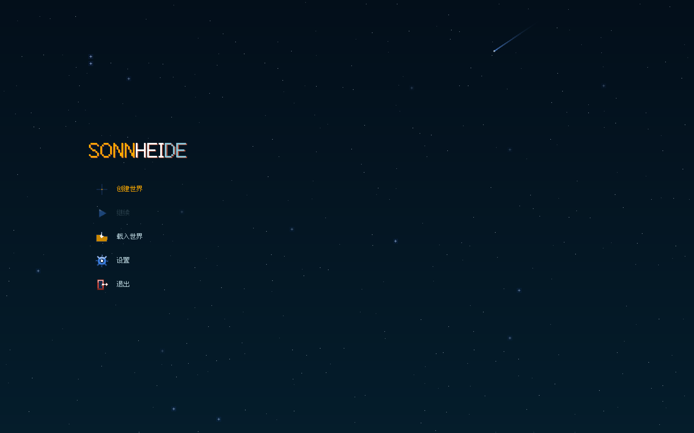
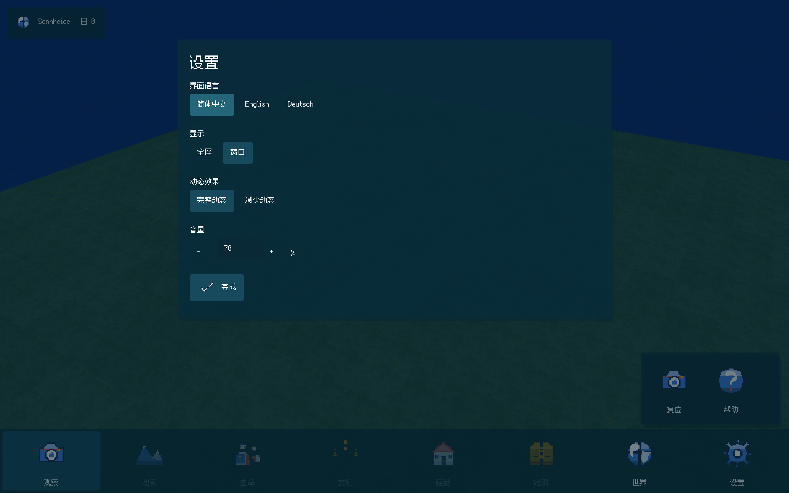

# S00/S01：细像素世界与半透明街机界面交付

2026-10-10。本报告取代上一批UI/地形的当前验收口径，旧报告保留为历史。实现以[ADR0019](../decisions/0019-fine-terrain-and-colorful-arcade.md)、[ADR0020](../decisions/0020-translucent-navy-borderless-ui.md)和[前端美术规范](../design/FRONTEND_ART_DIRECTION.md)为准；本批实际机器记录见[JSON](ARCADE_V2_DELIVERY.json)。这是S00/S01可运行开发切片，不是完整文明游戏。

## 实际结果

所有信息框、创建/设置窗口、底栏、输入、下拉、提示和浮动工具均采用深青蓝半透明填色。正文浅白蓝、12dp；重要标题24/36dp；底栏64dp图标与12dp短标签，无按钮描边。选中、悬停和键盘焦点由填色及亮度区分。窄窗口能滚动，完整三语工具名称可悬停查看。世界工具收紧为320dp，保存/载入/主页横向排列，不再被图标子节点撑成大块纵向按钮。

主页为原生GPU深青蓝星空，细星闪烁、偶发流星，紧凑菜单；没有图片加载或菜单World。原创25个UI图标共75个SVG/PNG输出，用32逻辑格及96/192整数采样，主要蓝红白黄，黄色本色为#ffaa00。已移除随Age整套改色的旧图标变体。

新世界实际格距250mm，默认512²核心即128×128m，当前核心上限1008²。格距进入创建、网格、拾取、支承、水深与存档；不是仅缩小材质。八档固定地形高度继续有效。材质32px/m，单材质像素约3.125cm，采用原创颜色簇、细像素水纹、方向光影、薄云与稀疏风动装饰花草。装饰不产生资源、树木、人物、任务或导航费用。既有显式2000mm几何profile可读写，不承诺迁移definition/asset hash不同的旧个人存档。

Blank/Earth两入口、地理选区、同源预览和发布、360°镜头、设置、中文/英文/德文、Age、世界改名、保存/继续/指定载入/退出持久读回已接入。Earth是地理范围到有限像素世界的统一风格化缩放，不宣称1:1地理尺度。界面准确显示生成的实际米数。

## 本批统一验收

在Apple M3开发机上一次全目标构建、完整CTest、ASan/UBSan及原生GPU贯穿：

```sh
python3 tools/build.py --sanitize --native-smoke --bundle --jobs 6
```

完整CTest **3/3通过，6.68秒**：core_tests 4.29秒/1216项不变量，project_contracts 0.83秒，ui_tests 1.56秒。UI覆盖三语、1280×800/480×640/640×480、DPI1/2、真实布局、输入隔离、键盘焦点、tooltip、实际渲染RGBA/alpha与紧凑工具行。[原始CTest日志](../evidence/arcade-v2/ctest.log)留存。

真实Metal窗口完成**58个操作、20张2560×1600 GPU截图**。非法坐标/尺寸是刻意执行的拒绝场景，纠正后可继续；没有用失败草案替换旧World。通过原生SDL事件验证旋转/平移/缩放/QE、焦点丢失释放、模态输入隔离和screen ray到core支承，镜头操作前后World hash一致。最后改名“退出顺序 · Ähren”，退出后重新读取持久存档验证。

原生动画对照的当地表现时钟推进1500ms，13994个RGBA通道变化超过1LSB；降低动态后CPU时钟严格冻结，GPU最终UNORM最大通道差为1/255，在规定舍入容差内通过，**不是字节完全相同**。动画不创建World或消费模拟RNG。

原始记录：[GPU世界](../evidence/arcade-v2/gpu-world.json)、[菜单GPU](../evidence/arcade-v2/gpu.json)、[原生操作](../evidence/arcade-v2/native-flow.json)、[镜头与拾取](../evidence/arcade-v2/camera-input.json)、[表现动画](../evidence/arcade-v2/presentation-motion.json)。JSON记录20张原始TGA哈希、精确源文件哈希和保存的PNG哈希。下面是GPU读回的无修饰、无损格式转换截图。





## 试玩与后续边界

双击仓库根目录的`Play_Sonnheide.command`，或运行`python3 tools/play.py`；它只启动已构建程序，不重新编译，也不清除个人存档。开发机独立包在`.build/package/Sonnheide/`。可用`--saves .build/arcade-v2-preview`隔离本批试玩存档。

下一步按施工计划进入S02：真实Godterrain事务、后果预览、占用fixture、坡道及完整存载恢复。当前新世界仍0人0楼；人物、机制树、建筑、经济、政治与编辑笔刷未生产实现，底栏对应入口保持禁用。不能把装饰花草或未来算法文档计为这些机制完成。

本批Windows统一构建将在源码发布后由PR CI独立执行，发布前不填写通过。以前的Windows CI只对应历史源码；本批Metal开发机结果不替代Windows GPU或Steam安装验收。唯一发行渠道保持Steam。
