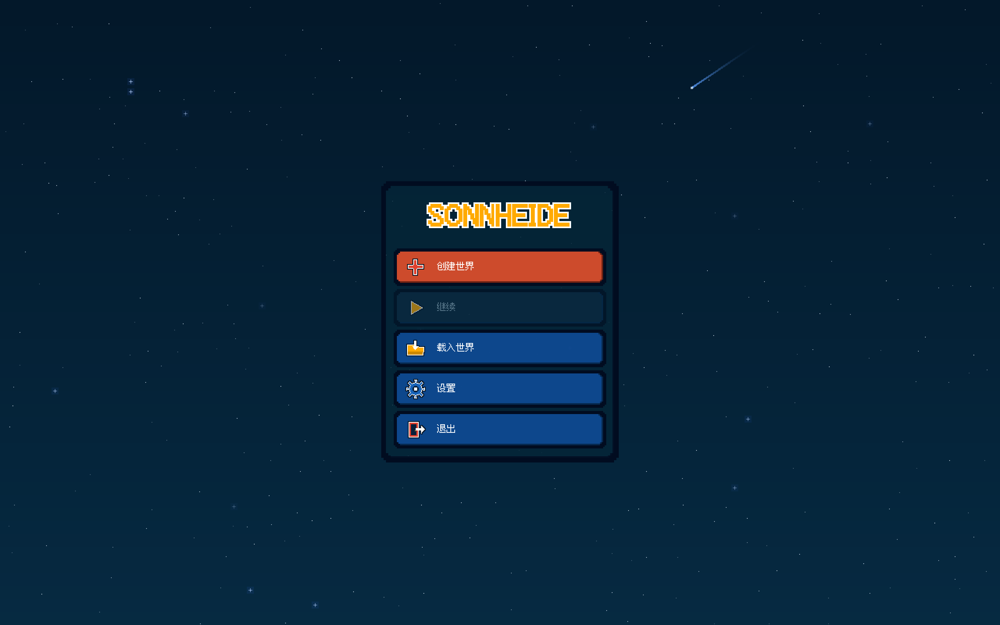
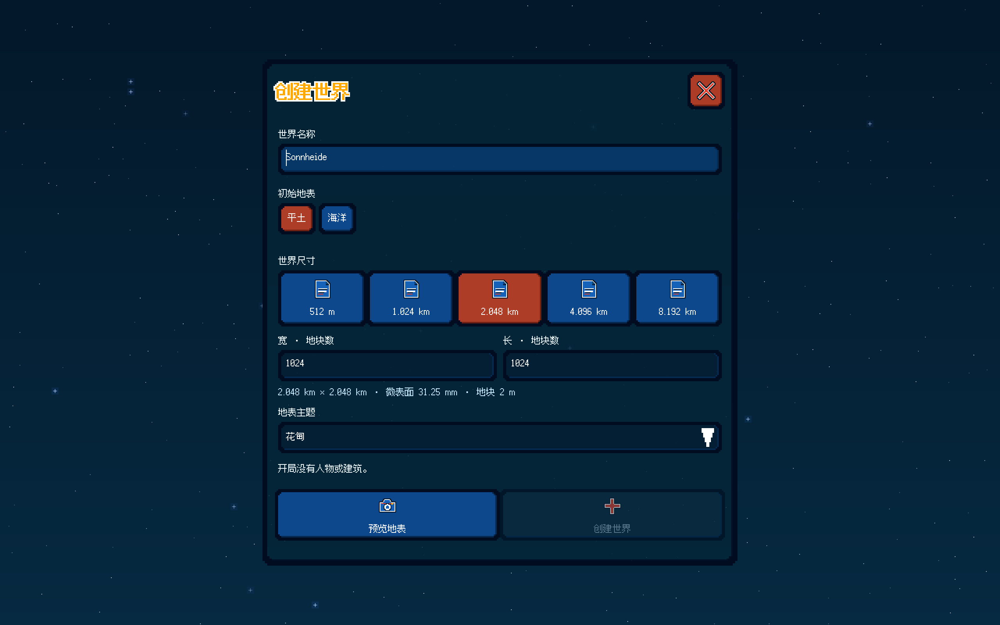
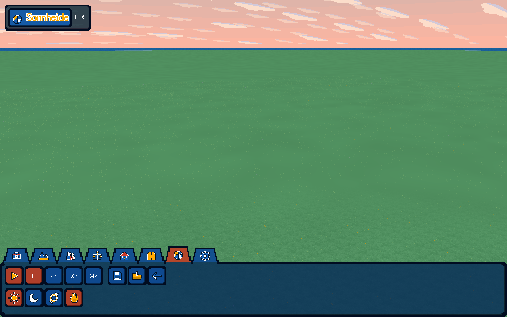
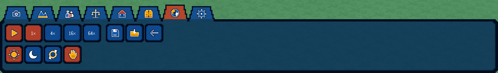
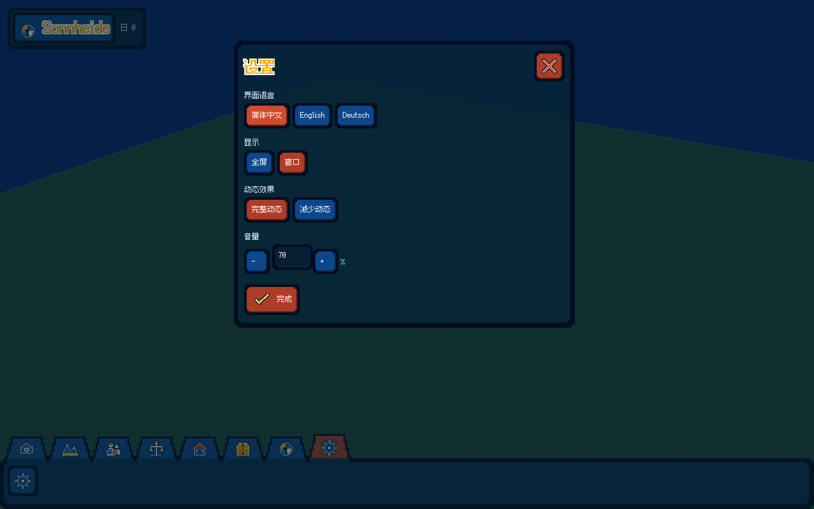
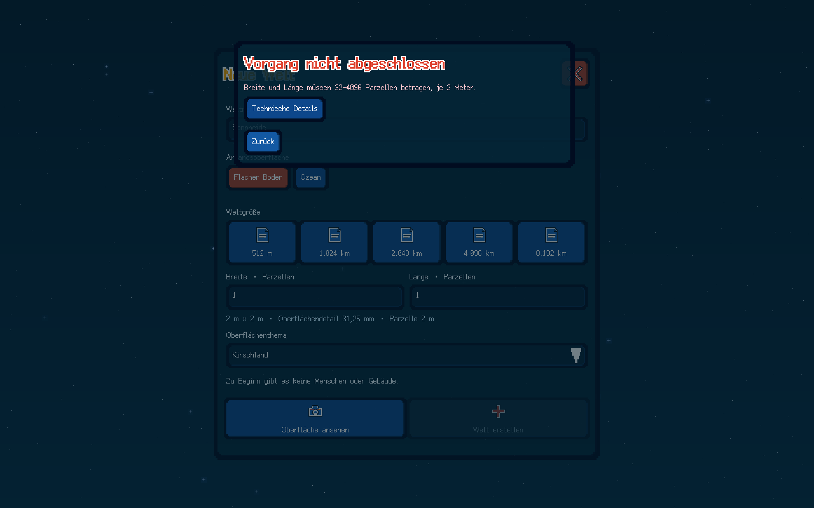

# 空白创建与平面描边街机UI交付

2026-10-10，ADR0022。本批按用户最新纠正实现，集中补修后的统一开发验收通过。记录对应实际代码、资源及GPU读回；设计文档不代替运行证据。

创建只保留空白平土/全海、五档尺寸、独立长宽、名称与地表主题。世界地图/地球选区、地图上传绘制与启动地理加载已移除；生产runtime和便携包不带GSHHG，来源、许可及历史核心回归保留在测试资源。创建表单居中、有界滚动；成功预览折起，360°查看与重开选项可用，参数变化使候选失效。

重要红/黄字与41个原创图标使用均匀纯白平面轮廓。取消白色定向高光、斜面与主页标题偏移投影，框和按钮只通过深色边缘表现厚度；中心保持深色半透明。蓝色进一步压深、红色改为略偏橙的深红，黄色本色`#ffaa00`。中文标题实际单向加粗，保留字腔，描边随实际DPI缩放。

八分区为搭在工具栏上沿的低矮阶梯梯形：顶窄底宽、底口开放、选中略高。常规宽68dp，小窗口58dp；选中44dp高，其余40dp高，32dp图标，6dp接合区替代栏顶边而不重复混合。点击后工具栏只显示对应分区；尚未实装工具明确禁用。参考已实际查看的[WorldBox开发者截图](https://x.com/Mixamko/status/1575249911507046400)，全部图标为项目原创。

统一执行：`python3 tools/build.py --sanitize --native-smoke --bundle --jobs 6`。

|检查|实际结果|
|---|---|
|全部原生目标|构建成功|
|完整CTest|3/3通过，122.86秒|
|核心具体不变量|71,101项通过|
|ASan/UBSan|启用，未报告错误|
|三语、多窗口与DPI|真实Rml交互、字形、滚动、聚焦及八分区测试通过|
|原生GPU流程|56项操作、22张2560×1600实际读回，通过最终退出存档读回|
|错误窗口与返回|实际顶层命中、SDL鼠标返回及权威错误清除通过；关闭后恢复下层可见键盘焦点|
|预览托盘|三语、三视口、两DPI实际内容完整容纳，无多余滚动条|
|实际居中表单|1216×1296物理像素，左672、上152，视口2560×1600|
|实际创建|平土、全海、最大尺寸、独立长宽及主题通过|
|候选/存载|取消保旧World，失败不发布，读回后发布，继续/载入/退出检查通过|
|表现时间|星空运动、降低动态冻结与恢复通过实际GPU像素比较|

本批先集中完成全部修改与跨模块审查，再统一构建全部目标并运行完整测试。实际截图检查发现错误层被表单遮挡及托盘2dp溢出，集中修复后再执行同一完整验收；未逐项反复构建。此前视觉尝试和修补前运行记录不作为本批证明。当前采用的验收目录为`native-312089de9eb8`，详细源码、资源和证据哈希见[机器记录](HEAVY_ARCADE_DELIVERY.json)。[原始验收日志](../evidence/heavy-arcade/acceptance.log)、[真实操作记录](../evidence/heavy-arcade/native-flow.json)及[实际指针层级证明](../evidence/heavy-arcade/error-layer.json)随Git托管。

实际截图为无损转换，PNG与原生TGA解码像素逐字节相同，没有贴字或后期修饰：

试玩：`python3 tools/play.py`或`Play_Sonnheide.command`；便携程序和完整资源在`.build/package/Sonnheide`。启动器直接运行已构建程序，不再次编译。

范围仍为S00/S01：初世界0人0楼，人物、机制树、建筑、Godterrain/坡道生产画笔及文明机制留给后续阶段。既有存档文件保留；当前仍严格验证定义与资产版本包，不宣称任意旧版本迁移兼容。开发机MetalGPU验收和Windows编译CI不代替WindowsGPU或Steam安装实测；唯一发行渠道为Steam。
