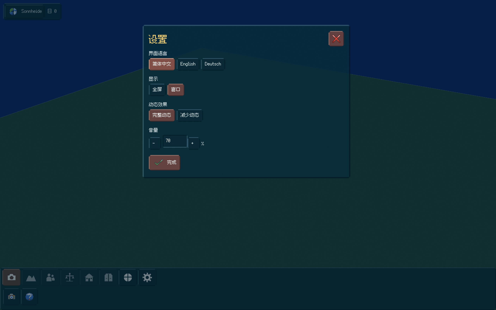
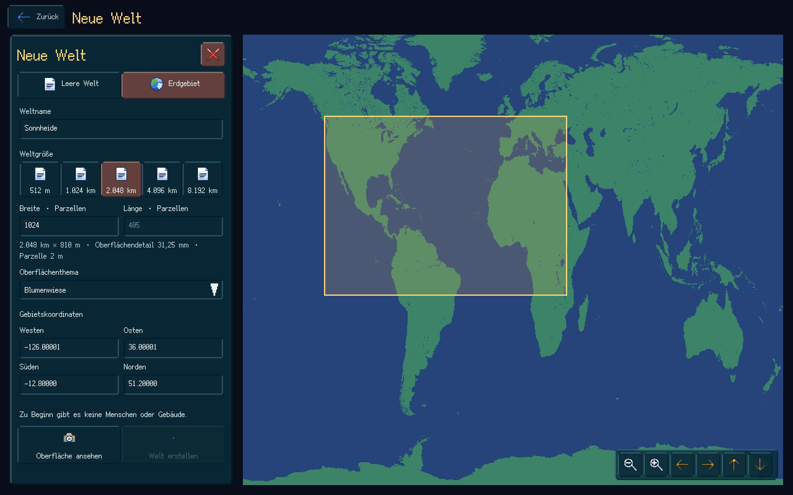
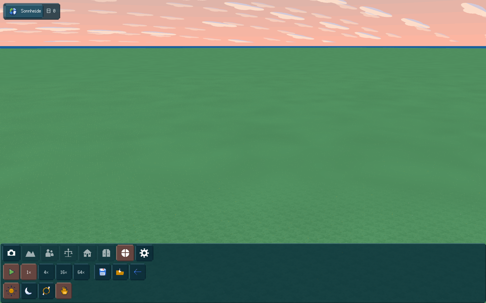

# 大世界、独立微地表和半透明界面交付

2026-10-10，本批 S00/S01 原生开发切片通过统一验收。完整命令：`python3 tools/build.py --sanitize --native-smoke --bundle --jobs 6`。构建全部目标，完整 CTest 3/3，114.88 秒，71,101 项核心不变量检查；ASan/UBSan 开启。实际原生 Metal/Apple M3、2560×1600，59 项流程操作、22 张 GPU 读回截图。机器数据、源文件哈希和证据清单见 [JSON报告](LARGE_WORLD_MICRO_SURFACE_DELIVERY.json)。

## 当前交付

- 窗口、弹窗、输入框、工具底栏和提示框统一深色半透明。像素外沿和内部填充互不覆盖，透明度不被重复混合；简中、英文、德文保留。WorldBox截图参考双层底栏，类别剪影与当前工具分开，图标原创。
- 2m 管理格与 64² 实际微表面分开，最小地表 31.25mm；默认2.048km，五档512m至8.192km。Blank长宽独立，Earth按选区纵横比生成。
- soil/sand顶面和水面全部0m；真实kind和微覆盖决定干湿，海床另有深度。支承、拾取、查询、细覆盖和存档同源；共面显示不靠高度偏移。
- 均匀区RLE、复杂岸线无损跨度/行字典/bitpacked微片，规范解码几何hash与驻留编码无关；流式hash不累积全世界原始位图。TERRAIN schema2保存共享palette与明确index_encoding，旧schema1保持原解释。
- 核心FillWaterOnly准备、后果和原子提交仅改变选中管理格中的水面微片，完整保留原有陆地kind/theme/revision；不赠材料。生产画笔和占用闭包仍属S02。
- 原生Earth框选使用局部UI覆盖，4次实际SDL motion、4次真实框几何检查、5次选区更新，拖动期间底图重采样0次；release和失焦解除捕获。地图六项导航通过三语、多视口、两种DPI真实命中点击测试。
- 地表取消大片硬矩形色差，保留细像素材质，以连续低对比不规则色调呈现。菜单闪星/流星确实运动；降低动态后两次实际GPU读回像素完全一致，恢复须等读回完成，未放宽验收容忍。

## 真实规模和预算

最大Blank原生创建、360°镜头、核心拾取、保存、返回、Continue均通过：4096²核心管理格、8.192×8.192km，周围另有真实海保护带。

完整GSHHG选区18–20°E、58–60°N，真实Stockholm群岛在4096²核心、31.25mm游戏空间微粒度生成并实际存载：195,869个岸线微片，几何45,805,746 bytes（43.7MiB），生成31,842ms；source payload capacity 191,438,888 bytes，scratch peak payload capacity 11,025,408 bytes。最终文件41,360,624 bytes，TERRAIN段41,358,188 bytes，读回hash相同。

128MiB仅为geometry预算；source、scratch、旧World、隔离候选、存档JSON和GPU另列，上述capacity不是进程峰值RSS。来源地理准确度也不能等同31.25mm游戏空间量子。复杂大Earth是权威生成/存档检查；本批实际Earth GPU场景核心宽1024，最大GPU/Continue场景为Blank。人口文明容量尚未测定。

## 实际画面

PNG由真实TGA无损转格式，逐像素读回相同；没有重新绘制或浏览器假截图。全部原始22张TGA哈希、复制的GPU参数、地图选择报告、相机拾取报告、CTest和完整验收日志见JSON及[证据目录](../evidence/large-world-micro)。

## 试玩和后续边界

双击项目根目录的 `Play_Sonnheide.command`，或 `python3 tools/play.py`；便携包在 `.build/package/Sonnheide`。程序不会因启动再次编译。

当前是基础世界切片：人物、机制树、建筑、产业和生产编辑笔刷仍在后续阶段；未实现工具明确禁用。唯一发行渠道Steam；本机Metal仅开发验收，Windows目标GPU及实际Steam安装尚待实测，GitHub CI不能代替它们。下一阶段按现计划进入S02地形编辑/坡道/实际空间闭包，随后S03正式原创建筑、人物和服装资产。
