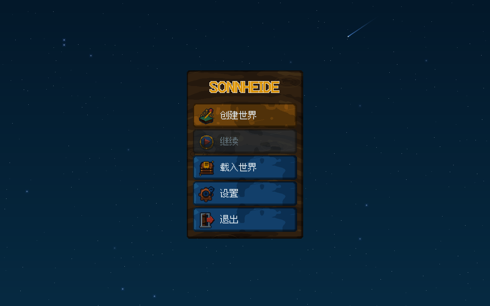
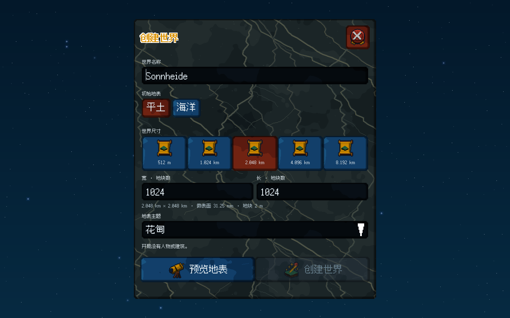
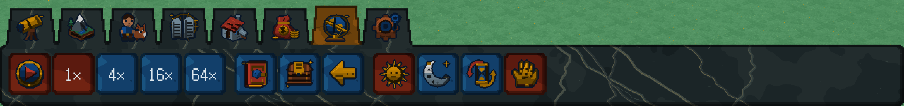

# 实物像素界面交付

2026-10-10 / ADR0023。S00/S01本批开发设备验收通过。当前版本将完整界面换成原创实物像素风，并落实用户最新要求：保留高分辨率、加粗轮廓与结构线，鲜艳颜色压暗。旧HEAVY_ARCADE_DELIVERY仅保留历史结果。

## 实际交付

41个图标共123件透明SVG、96/192px PNG，48格逻辑画布、二值透明与整数放大；外轮廓至少两格，十诫碑十道铭文在最终画布中均为两格粗。所有鲜艳材质像素的登记加权亮度不超过160，实际最高153.9144，超过220的极亮像素为零。这里的亮度是编码RGB字节的加权指标，非物理光度。

九种原创512²材质用于真实原生界面：裂纹大理石、黄铜、朱红、黑曜石、木、羊皮纸、皮革、铁和蓝珐琅。3dp暗边、3dp厚度，页签保留6dp石质接颈；最近点采样、1纹素/逻辑dp与缓存UV分块几何，不拉长贴图或运行生成噪声。独立只读GPU像素复核确认大理石原件与真实画面匹配，未见纹理接缝、盖字或漂白。

工具图标48dp、按钮60dp；执行文字24dp，按真实已加载字体字宽排版。预览创建托盘与短提示框随内容收紧，避免短文字占巨大空牌。主页、居中创建、八工具分区、设置、帮助、存档、后果和错误层全部采用新材质；键盘焦点、三语、模态输入隔离与真实disabled语义保持有效。

## 统一验收

最终命令：`python3 tools/build.py --sanitize --native-smoke --bundle --jobs 6`。

|证据|实际结果|
|---|---|
|ALL原生目标、完整CTest|3/3通过，130.21秒|
|核心不变量|71,101项检查通过|
|ASan/UBSan|最终完整测试与原生流程通过|
|原生GPU流程|66个操作、32张2560×1600真实帧读回|
|真实UI资源|九种材质、26种实际使用图标成功上传，最近点采样|
|三语与布局|中英德；480×480、480×640、640×480、1280×800；密度1/2|
|大世界回归|8.192km × 8.192km、4096²管理格、31.25mm微表面，预览/拾取/Continue一致|
|弹窗与输入|真实SDL确认按钮命中、错误层置顶、输入及模态隔离镜头|
|表现时钟|真实星空运动；降低动态冻结，仅容许GPU字节舍入差|

首次统一验收实际发现UI测试中的四处类型初始化错误及直接字体查询使用大写族名返回空句柄的问题，均已集中修复。字体测量现在验证实际引擎与字体，不用估计宽度掩盖缺失。最终结果来自修复后的全部目标和完整套件，未变shader复用缓存。

机器记录：[PHYSICAL_PIXEL_DELIVERY.json](PHYSICAL_PIXEL_DELIVERY.json)。[CTest原始日志](../evidence/physical-pixel/ctest.log)、[统一验收日志](../evidence/physical-pixel/acceptance.log)、[原生流程](../evidence/physical-pixel/native-flow.json)、[GPU记录](../evidence/physical-pixel/physical-ui-gpu.json)和各帧hash同步托管。下列PNG为原生TGA的无损导出；图标总览明确是原件联系图。

[全部原件图标](../evidence/physical-pixel/icon-atlas.png)、[德文设置](../evidence/physical-pixel/settings-de.png)、[帮助](../evidence/physical-pixel/physical-help.png)、[存档目录](../evidence/physical-pixel/physical-save-ledger.png)、[错误层](../evidence/physical-pixel/creation-error.png)可直接审阅。

## 试玩和边界

双击仓库根目录`Play_Sonnheide.command`或运行`python3 tools/play.py`；启动器只启动已验收程序，不编译。完整便携包在`.build/package/Sonnheide`。个人档不进入Git，旧档保留原件；严格的定义和资产包核验保持有效，没有任意旧包迁移。

当前世界仍为0人物、0建筑；改地/坡道/生命/建筑/文明等后续生产阶段尚未交付。本批是开发设备Metal证据；唯一发行平台为Steam，Windows GPU与Steam安装仍待实机验收。Windows CI构建不替代实机。原创资产未授予公共开源许可。
