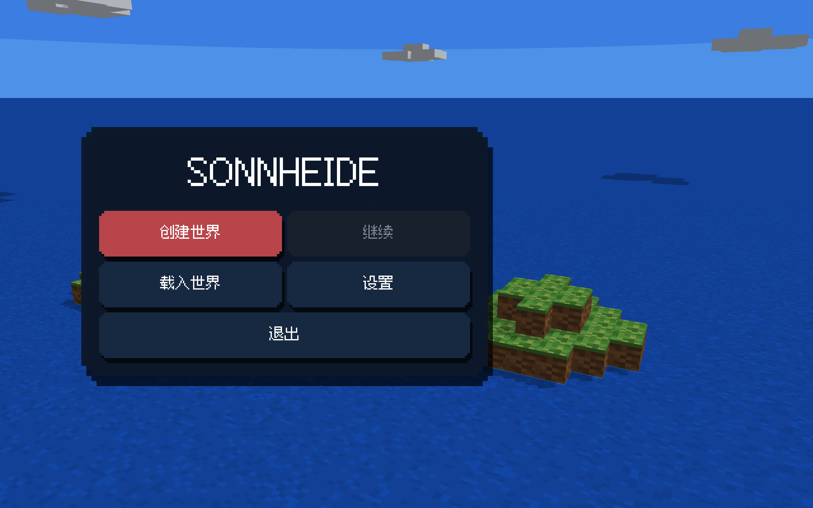
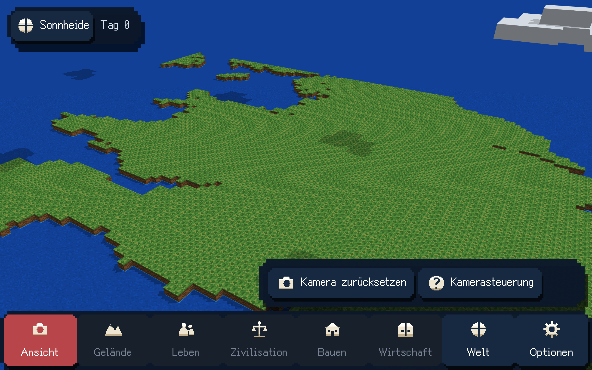
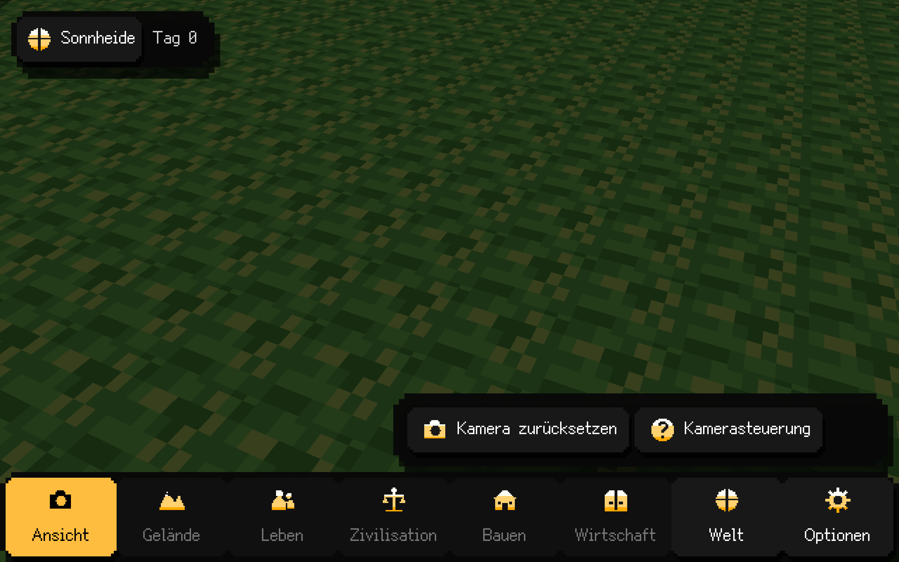

# S00/S01 原生开发切片交付

2026-10-10。本批重新实现了原生基础与创建世界，并按最新要求将所有已实现前端彻底改为复古街机像素风。**开发机验收通过；目标Windows GPU及Steam安装仍待验。** 不将设计、旧程序或CI代替目标平台实测。精确结果及图像SHA见[机器报告](S00_S01_NATIVE_DELIVERY.json)。

## 当前可试玩

运行 `python3 tools/play.py`，本开发设备可双击仓库根目录的 `Play_Sonnheide.command`。程序是独立SDL3窗口中的真实3D客户端。`.build/package/Sonnheide`包含可执行文件和完整资源，运行时从程序旁的runtime读取；本批贯穿验收实际从这个便携包启动，没有依赖编译时资源绝对路径。

主页保留创建、继续、载入、设置、退出。Blank支持平土/全海和八地皮主题；Earth支持全球海陆导航、拖选、缩放/平移、最终同源3D预览及创建。新世界0人物/0动物/0楼/0机制树。中键360°轨道旋转、右键平移、滚轮缩放、WASD/QE、Space暂停；输入框及模态窗口隔离镜头。世界可改名、控制时间倍率、切换Light/Darkness、手动/自动Age、保存、返回、继续、选择checkpoint载入。

地形笔刷、坡道、人物/动物、树果、建筑、制度、经济和战争尚未交付。本阶段相关底栏明确禁用，不显示假成功。地图容量目前32—1008格每边，Earth高度按选区比例派生；这是本批范围，不是最终世界容量承诺。

## 实际画风

全部现有页面、按钮、输入框、下拉框、滚动条、弹窗与八底栏使用填充阶梯像素几何、偏移块状阴影和真正的Fusion Pixel字体。全部图标为原创24格二值alpha像素sprite，96/192整数放大、GPU点采样。中英德字体均已核实际cmap；德文底栏使用Optionen，窗口标题仍为Einstellungen。Light深蓝/白/红，Darkness黑/白/#ffaa00，直接读取World环境Age；深色选中图标黑色乘染确保可辨认。没有任何颜色描边、绿色或紫色UI。

世界使用原创16×16顶/侧面地皮，24图层，8像素/米，简单方向光、硬像素阴影和真正长方体云。水为静态蓝色像素图案，深浅按实际权威深度离散取值；外海与保护海同深蓝。已移除写实反光、PBR、法线/粗糙度贴图、Fresnel海水、柔云和灰雾。菜单背景是独立表现用方块群岛，不创建World或保存。原创图案、材质、云、图标均不复制Minecraft或WorldBox资产。

## 统一验证

命令：`python3 tools/build.py --sanitize --native-smoke --bundle --jobs 6`。先集中完成本批修改和审查，再构建ALL目标并执行完整CTest；实际错误集中修复后重验，未改库、shader和源资源使用缓存。最终3/3测试通过，7.14秒；ASan/UBSan覆盖核心、应用与匹配RmlCore。本开发设备Apple M3 / Darwin25.6.0 arm64，实际renderer Metal，GPU2560×1600、逻辑1280×800。

- core_tests：整数规范/Unicode NFC、确定性RNG、Ref墓碑、单写者/重放/陈旧命令、八档几何/射线/支承、真实GSHHG及日期线/极域、候选预算/取消/晚结果、Age/时钟和SONNSAV1多段存载/故障。
- project_contracts：核心无窗口/GPU依赖、UI无描边及禁用色、实际离散图标像素/hash、像素字体原件/许可/cmap、23份完整运行定义和完整资源。
- ui_tests：真实RmlUi三语/DPI1/2及窄屏布局/滚动、像素Decorator实际绘制、焦点与Age配色、Dark黑色图标quad、草案/下拉/typed动作、模态隔离和错误。
- 实际原生GPU贯穿57个记录动作完成，17幅GPU截图。真实SDL队列验证轨道/平移/缩放/QE、底栏滚轮隔离、失焦释放拖动、文本/模态隔离及关闭后W恢复；screen ray命中同一core支承2000mm，镜头操作保持World hash。Earth左拖→失焦→无键普通移动保持原选区。
- 创建/首档读回、返回/继续/选档载入、有效改名预览/提交、取消和错误恢复贯穿成立。UI改名提交与原生QUIT同队列时，退出最后checkpoint持久读回名称为“退出顺序 · Ähren”，对应最终World hash；中途关窗不能产生pass报告。
- 实际GPU full图与mean-base贴图消融在相同镜头的1100×670地面区域逐像素不同，平均RGB绝对差18.78/14.15/8.45，证明运行画面使用离散图案；这不是对PBR通道或未来资产的证据。

原始完整证据位于 `.build/evidence/native-2ea30fe6902b`；JSON记录全部17幅TGA/PNG哈希，仓库保留三幅未经修改像素的PNG和实际流程/镜头/GPU报告。PNG仅无损转换GPU回调TGA，没有重绘画面。个人存档、缓存及本机工具不提交。

## 持久化与平台边界

所有世界变更经过同一Authority。候选World只有首checkpoint完成持久读回后发布；WorldId/session/draft/candidate隔离晚结果。保存payload flush、不可变checkpoint、精确hash读回、前一Continue原字节、pending读门与进程内隔离latch共同工作。pointer rename之后失败如实返回DURABILITY_UNKNOWN，不宣称磁盘指针没变。若存储同时拒绝恢复读门的flush，进程内Continue仍保旧确认World；重启不能保证自动选择旧指针，只能从保留checkpoint显式恢复。这一真实故障边界已测试并报告。

Windows CI配置为Windows2022/Python3.9，统一构建完整CTest并保存包含runtime的程序包；源归档/字体/地理许可固定哈希、UTF-8显式读写。发布后的实际CI结果追加到机器报告。CI不执行GPU，不等于Windows D3D11实机、中文IME设备联测或Steam安装。Steam为唯一发行渠道，Metal仅开发设备验证，不建立Apple商店发行流程。音频设备与音量已接入，正式音乐/环境音资产尚未制作。

后续按计划进入S02可编辑地形/坡道与占用闭包，再进入S03原创建筑、人/动物/衣物正式代表件；不把当前空世界称为完整游戏。
